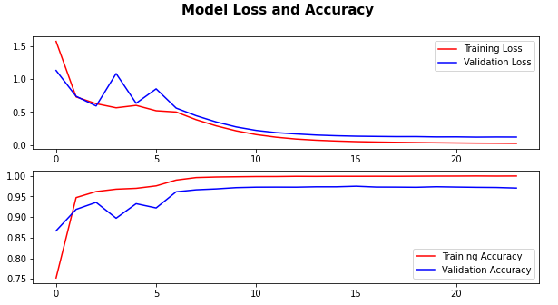

# Traffic Signs Classification with Deep Learning
This repository contains a Python notebook that demonstrates multi-class classifcation using deep learning on a traffic signs dataset. The goal is to create a model that can accurately classifiy images of traffic signs and specify their corresponding classes.

## Dataset
The dataset used in this notebook is the GTSRB - German Traffic Sign Recognition Benchmark, which consists of thousands of images representing various traffic signs.It contains 43 classes of traffic signs having varying light conditions and rich backgrounds.

## Dependencies
To run the notebook, you need the following dependencies:
* TensorFlow
* Numpy
* Pandas
* Matplotlib
* Seaborn
* PIL

## File structure
* classification.ipynb: The main Jupyter Notebook containing the code and instructions for multi-class classification of traffic signs and creating the model.
* model deployment.ipynb: The Jupyter Notebook containing the code for testing and deploying the model.

* images/: Directory containing the dataset files, including images and class labels.
* images_to_predict/: Directory to add custom traffic signs images to test the model.

## Results
The model could get near 98% accuracy on the validation set using only 4 convoloution layers.

